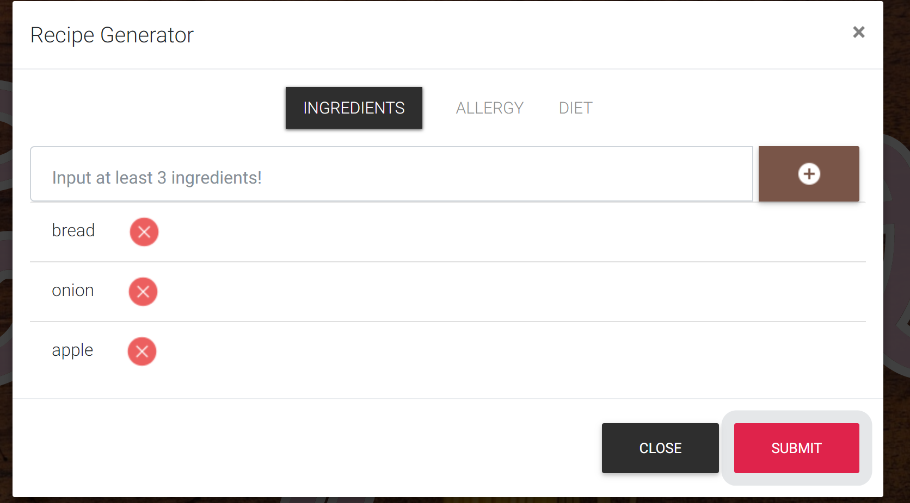
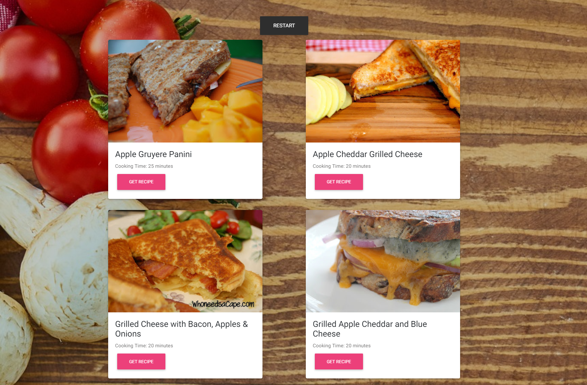
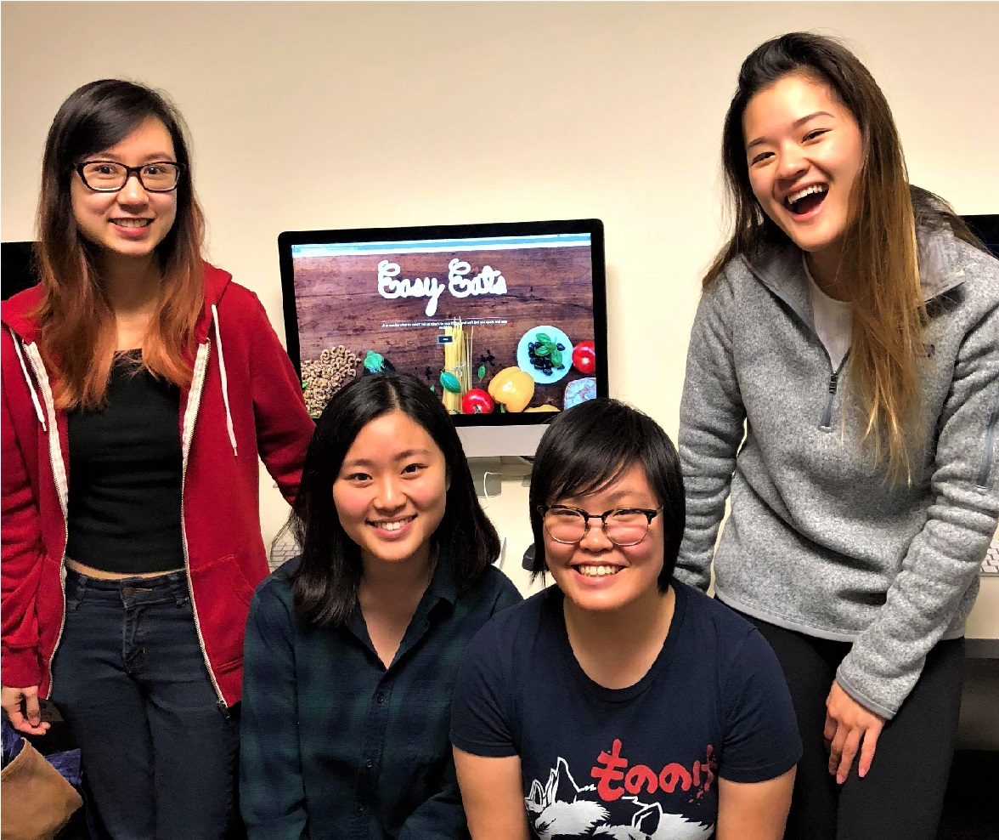

## **Introduction**
Want to cook a meal but when you look inside your fridge you only have an onion, ketchup, and maybe salt? When you try to look up a recipe do you get back results with your ingredients, but it requires a thousand other ingredients? 

Well look no further! We built a website that helps hungry people realistically put together a dish in 30 minutes or less! Enters at least three main ingredients in EasyEats while being able to filter out recipes based off of your personal allergies and diet restrictions. EasyEats uses an API to suggest the best recipes for the given input. In this case, the “best” recipes are easy recipes under 30 minutes where the user will have all or majority of the input ingredients.

## **The Website**

Use EasyEats **[here](https://info343b-w18.github.io/info343final-group2/)**!!!

## **Meet the Devs!**

Backend: Maggie Tsang and Alaina Kwan
* Interact with the Yummly API to get the desired recipe
* Design the algorithm to return the most relevant recipes 

Frontend: Abby Huang and Eshin Ang 
* Responsive UI
* Welcome homepage and quiz setup
* Format returned recipes

## **Frameworks and Libraries used**
* 
* 